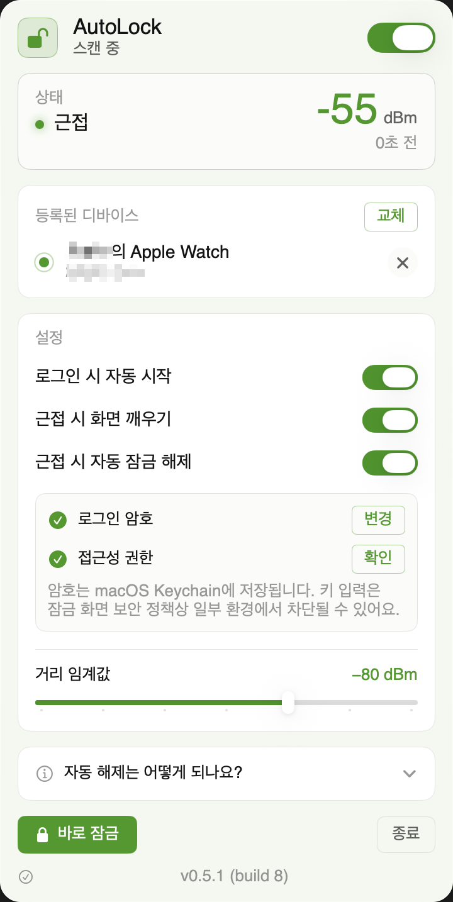
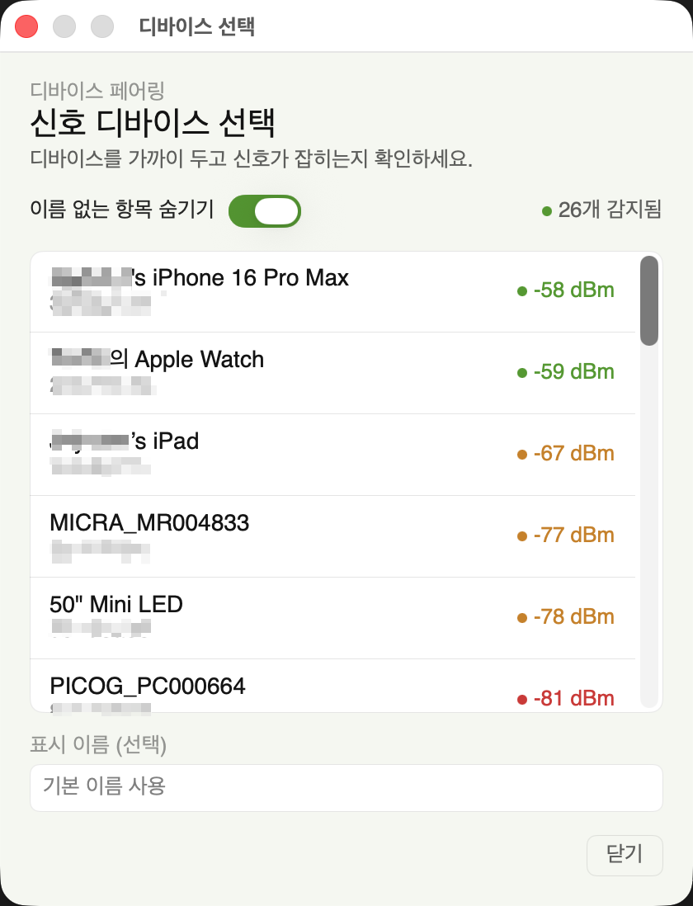
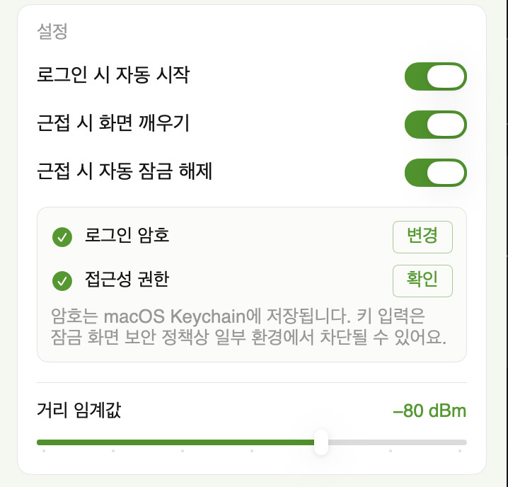
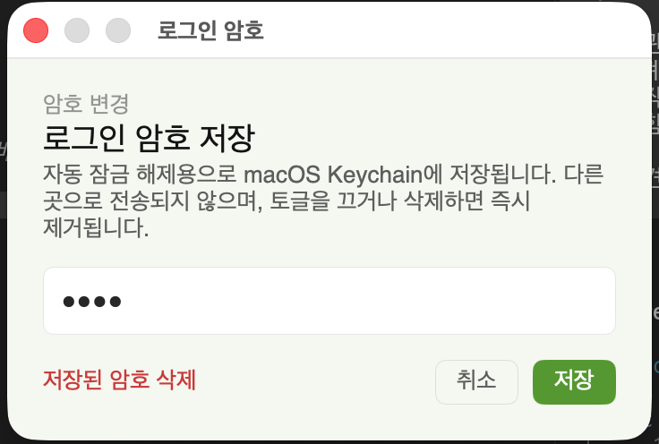

# AutoLock

블루투스(BLE) 신호 강도로 휴대폰/워치가 멀어지면 macOS 화면을 자동으로 잠그는 메뉴바 앱.
다시 가까워지면 화면을 깨워서 Touch ID/Apple Watch 인증 창을 띄울 수도 있고,
**근접 시 자동 잠금 해제**(저장된 로그인 암호 자동 입력)도 옵션으로 제공합니다.

추적 디바이스는 한 번에 한 개만 등록 가능합니다.

> **자동 해제는 환경에 따라 다릅니다.** macOS의 잠금 화면이 외부 키 이벤트를 차단하는
> 일부 환경(특히 최신 보안 설정)에서는 자동 입력이 무시됩니다. 그 경우 **Apple Watch
> Auto Unlock** 또는 Touch ID로 인증해야 합니다.

<table align="center">
  <tr>
    <td align="center" width="33%">
      <br/>
      <sub>메뉴바 팝오버</sub>
    </td>
    <td align="center" width="33%">
      <br/>
      <sub>디바이스 선택</sub>
    </td>
    <td align="center" width="33%">
      <br/>
      <sub>설정</sub>
    </td>
  </tr>
</table>

## 동작 방식

1. CoreBluetooth로 주변 BLE 신호를 스캔
2. 등록된 디바이스의 RSSI(신호 강도)를 이동평균으로 스무딩
3. **단일 임계값** + 신호 끊김 허용시간으로 잠금 결정
   - RSSI ≥ 임계값 → 근접 (정상 사용 중)
   - RSSI < 임계값이거나 신호가 허용시간 내내 안 잡히면 → 카운트다운 시작
   - 카운트다운이 끝까지 진행되면 잠금
   - RSSI ≤ 임계값 - 10 dBm → 즉시 잠금
4. 잠금: `SACLockScreenImmediate` 호출 (메뉴바의 "Lock Screen" 항목과 동일한 경로, macOS 26 호환)
5. (옵션) 디바이스가 다시 가까워지면 `IOPMAssertionDeclareUserActivity`로 화면을 깨움 — 사용자는 Touch ID/암호/Apple Watch로 인증
6. (옵션, 실험적) **자동 잠금 해제**: 근접 복귀 시 Keychain에 저장한 로그인 암호를 잠금 화면에 자동 입력. 잠금 임계값보다 +10 dBm 더 가까울 때만 트리거되어 옆방 신호로 인한 오작동을 막습니다.

### 카운트다운 표시

- 카운트다운이 시작되어도 화면 오버레이는 마지막 5초가 남았을 때만 등장합니다 (5 → 4 → 3 → 2 → 1).
- 메뉴바의 상태 텍스트에는 전체 남은 시간이 표시됩니다.
- 카운트다운 도중 신호가 회복되면 즉시 초기화되며, 다음 이탈 시 처음부터 다시 카운트.

<p align="center">
  
</p>

## 빠른 시작

```bash
./build_app.sh
open ./build/AutoLock.app
```

첫 실행 시 macOS가 Bluetooth 권한을 요청합니다. 허용해야 스캔이 시작됩니다.

### 디바이스 준비

iPhone/Android 폰이 BLE 신호를 송출해야 Mac이 RSSI를 잡을 수 있습니다.

**별도 앱 없이 가능?**
- 네 — iOS/Android는 시스템 서비스가 일부 BLE 신호를 평소에도 내보냅니다.
- 단, **Apple 기기는 프라이버시 정책상 BLE 식별자(peripheral ID)를 수~수십 분 단위로 랜덤화**합니다.
  식별자가 바뀌면 Mac은 같은 폰으로 인식하지 못해 카운트다운이 시작됩니다.
- "오늘 한 번 데모" 정도면 시스템 신호로 충분하지만, **상시 사용에는 신호 송출 앱이 안정적**입니다.
- 가장 안정적인 선택은 **Apple Watch Auto Unlock** — 워치는 Mac과 사전 페어링되어 있어 식별자 회전과 무관.

신호 송출 앱을 쓴다면:

| 기기            | 권장 앱                                                       |
| --------------- | ------------------------------------------------------------- |
| iPhone          | **nRF Connect for Mobile** → Advertiser 탭                    |
| Apple Watch     | (직접 신호 송출 어려움) → iPhone으로 대체하거나 Auto Unlock 활용 |
| Android Phone   | **nRF Connect for Mobile** → Advertiser 탭                    |
| Android Watch   | **nRF Connect** Wear OS 버전                                  |

신호 패킷에는 `Complete Local Name`을 붙여두면 메뉴 픽커에서 식별이 쉽습니다.
앱이 켜진 동안에는 동일한 peripheral identifier가 유지되므로 Mac이 같은 디바이스로 계속 인식합니다.

### Apple Watch와 함께 쓰기 (macOS 기본 기능)

이 앱은 **잠금만** 합니다. 해제는 macOS가 기본 제공하는 Apple Watch Auto Unlock으로:

1. 시스템 설정 → 잠금 화면 → **"Apple Watch로 Mac 잠금 해제"** 직접 활성화
   (이건 Apple이 제공하는 시스템 기능이며, 본 앱이 구현한 기능이 아닙니다)
2. AutoLock이 자물쇠를 잠그면, Apple Watch가 손목에 있고 잠금 해제된 상태에서
   Mac을 깨우는 것만으로 macOS가 알아서 풀어줍니다

Apple Watch가 없으면 Touch ID/비밀번호로 직접 해제해야 하지만, **"근접 시 화면 깨우기"**
토글을 켜두면 Mac에 다가가는 순간 화면이 미리 켜져서 Touch ID 한 번으로 즉시 풀립니다.

### 자동 잠금 해제 (실험적, Apple Watch 없이)

암호 자동 입력 방식. 메뉴 → **근접 시 자동 잠금 해제** 토글:

1. 토글을 켜면 두 가지 항목이 펼쳐집니다.
   - **로그인 암호** — "설정"을 눌러 macOS Keychain에 저장 (외부 전송 없음)
   - **접근성 권한** — "허용"을 눌러 시스템 설정 → 손쉬운 사용에서 AutoLock 활성화
2. 둘 다 초록 체크가 뜨면 준비 완료.
3. 잠긴 후 디바이스가 충분히 가까워지면 (잠금 임계값 + 10 dBm) 화면이 깨고
   암호가 자동 입력되어 풀립니다.

<p align="center">
  
</p>

**한계와 보안 메모**
- macOS 잠금 화면이 외부 키 이벤트를 차단하는 환경(보안 정책에 따라 다름)에서는
  화면 깨우기까지만 동작합니다. 이 경우 Apple Watch Auto Unlock과 병행하세요.
- 암호는 Keychain에 저장되며, 무인 읽기 ACL은 현재 AutoLock 서명으로 제한됩니다.
  ACL을 안전하게 만들 수 없으면 저장하지 않습니다. 토글을 끄거나 "삭제"를 누르면
  즉시 제거됩니다.
- 넓은 ACL을 사용한 이전 버전의 저장 암호는 업데이트 후 첫 실행에서 제거되므로,
  자동 잠금 해제를 계속 쓰려면 로그인 암호를 한 번 다시 입력해야 합니다.

### 설정

메뉴바 아이콘 클릭 →

1. 우상단 토글로 활성화
2. **+ ADD** (또는 **REPLACE**) 버튼 → 별도 윈도우의 라이브 스캔 목록에서 디바이스 선택
   (가까이 두면 RSSI 높은 순으로 정렬됨). 이미 등록된 디바이스가 있으면 새 선택이 기존 항목을 대체합니다.
3. **거리 임계값** 슬라이더 — −40 ~ −100 dBm, 10 단위 조정
   - 기본값은 **−80 dBm** (권장 범위 −75 ~ −85 dBm의 중앙). 거리에 따라 직접 측정해보고 조정
   - 즉시잠금 임계값은 자동으로 `임계값 - 10 dBm` (예: 임계값 -80 → 즉시잠금 -90 dBm)
4. **로그인 시 자동 시작** / **근접 시 화면 깨우기** 토글

> **신호 끊김 허용**은 **15초로 고정**되어 있습니다(설정 항목 아님). 신호가 잠깐
> 끊겼다고 바로 잠그지 않도록 하는 허용 시간으로, 이전 버전의 사용자 조정
> 슬라이더는 제거되었습니다.

## 임계값 가이드

RSSI는 환경에 따라 천차만별이므로 직접 측정 필요:

```
가까움 (<1m):  -40 ~ -55 dBm
보통 (1~3m):   -55 ~ -75 dBm
멀어짐 (>3m):  -75 ~ -95 dBm
```

벽/장애물이 있으면 더 약해집니다.

## 자동 시작

메뉴 → "로그인 시 자동 시작" 토글. macOS 13+ `SMAppService` 사용.

## 업데이트 확인

앱을 켜면 GitHub Releases에서 최신 버전을 자동으로 확인합니다(메뉴 하단 버전을
눌러 수동 확인도 가능).

- 새 버전이 있으면 메뉴에 **"새 버전 vX.Y.Z — 업데이트"** 버튼이 뜹니다.
- 누르면 해당 릴리스의 `arm64` ZIP을 내려받아 **SHA256SUMS.txt**, bundle ID·버전·
  아키텍처, 현재 앱과 동일한 코드서명을 모두 검증한 뒤 앱 번들을 원자적으로
  교체합니다. 새 앱이 시작되지 않으면 기존 앱으로 롤백합니다.
- 자가교체가 불가능한 위치(앱이 read-only translocation 상태이거나 설치 폴더에
  쓰기 권한이 없을 때)에서는 자동으로 **DMG 수동 설치** 안내로 폴백합니다.

> **권한 유지**: v0.5.0부터 고정 self-signed 인증서로 서명해, 업데이트로 앱이
> 교체돼도 macOS가 같은 앱으로 인식합니다 → 블루투스·접근성 권한이 유지됩니다.
> (ad-hoc 서명이던 이전 버전은 업데이트마다 권한이 리셋됐습니다.)
>
> **v0.4.0 이하 → v0.5.0**: 이번 한 번은 DMG 수동 설치 + 권한 1회 재허용이
> 필요합니다. 이후 v0.5.0 → v0.5.1부터는 권한 유지된 채 자동 교체됩니다.

## 배포 (동료에게 공유)

```bash
./release.sh
```

`release.sh`는 산출물을 만들기 전에 유의미한 제품 로직의 라인 커버리지 100%를
강제합니다. 한 줄이라도 누락되면 배포가 중단됩니다.

## 테스트와 커버리지

```bash
./scripts/test.sh       # 전체 테스트
./scripts/coverage.sh   # 테스트 + 유의미한 라인 커버리지 100% 게이트
```

커버리지 포함 범위와 네이티브 macOS/UI 경계의 제외 근거는
[`docs/TESTING.md`](docs/TESTING.md)에 명시되어 있습니다. 이 프로젝트에서 말하는
100%는 전체 파일을 억지로 실행한 raw 수치가 아니라, 결정론적 제품 로직 100%입니다.

`dist/`에 다음이 생성됩니다:
- `AutoLock-<version>-arm64.dmg` (드래그-드롭 설치)
- `AutoLock-<version>-arm64.zip` (압축 풀고 Applications로)
- `SHA256SUMS.txt`

self-signed 서명(Apple 공증 없음)이라 동료가 첫 실행 시 Gatekeeper 우회가
필요합니다. `INSTALL.md`를 함께 보내주세요.

> 릴리스 빌드는 고정 self-signed 인증서가 필요합니다(권한 유지를 위해). 처음
> 한 번 `./scripts/create_signing_cert.sh`로 생성하고 `.p12`를 백업하세요.
> 자세한 내용은 `scripts/create_signing_cert.md`.

## 한계

- BLE RSSI는 정밀한 거리 측정이 아닙니다. 사람이 신호 사이에 들어가도 -10 dBm 이상
  떨어집니다. 신호 끊김 허용시간으로 완화하지만 완벽하지 않음.
- Apple 기기의 BLE 식별자는 시스템 정책상 주기적으로 회전합니다. 신호 송출 앱이 켜진 동안에만
  안정적입니다.
- 폰 BLE 신호는 기기 정책에 따라 수~수십 초씩 일시적으로 끊깁니다. 끊김이 잦으면
  허용시간을 늘리세요.
- 자동 해제(암호 자동 입력)는 macOS 잠금 화면의 키 이벤트 차단 정책에 좌우되어
  환경에 따라 동작하지 않을 수 있음 → Apple Watch Auto Unlock 또는 Touch ID와
  병행 권장.

## 구조

3계층 — 의존성은 안쪽(순수 도메인)으로만 흐릅니다.

- **AutoLockCore** — 순수 도메인(Foundation only). 근접·잠금·업데이트 결정 로직을
  부수효과 없이 담아 단위 테스트됩니다.
- **AutoLockKit** — 컨트롤러 계층. 상태 머신과 BLE/설정 배선을 맡고, 시스템 부수효과는
  프로토콜로 주입받습니다.
- **AutoLock** — 조립 루트 + 메뉴바 UI + 시스템 API 어댑터(executable).

파일 단위 책임은 각 소스의 상단 주석에 적혀 있습니다.

## 빌드 요구사항

- macOS 13+
- Apple Silicon (arm64)
- Swift 5.9+ (Xcode 15 또는 Command Line Tools)
- (선택) Pretendard 폰트 — 설치되어 있으면 UI에 자동 적용, 없으면 시스템 폰트로 fallback

## 라이선스

[MIT](LICENSE) © Jaymon (stomx)
